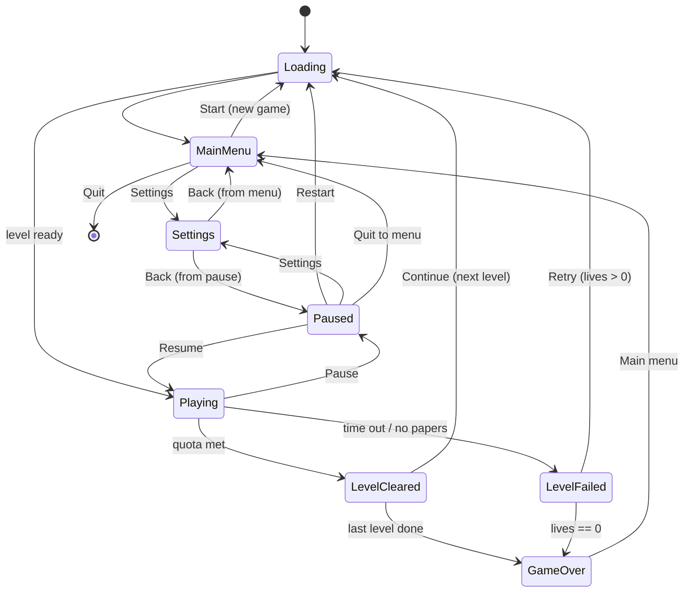

# Paperboy - a small game (design + build plan)

> Status: PLAN (not started). A vertical-slice game to exercise the game-ready runtime end to end.
> Locked decisions (2026-08-13): third-person 3D follow camera; FREE-ROAM a town block; PRIMITIVE
> blockout art. Build next session from this doc.
> Author: Opus, from a design exchange. Opus builds; Fable reviews per phase.

## Concept

Ride a bike around a town block as the paperboy. Each level gives you a stack of papers and a
countdown. Deliver to the block's subscriber houses before time runs out while avoiding traffic,
pedestrians, and street junk. Hit the delivery quota to clear the block; blocks get bigger, busier,
and tighter on time as you go. It is a small, arcade, score-chasing loop - not a sim.

## Core loop (one level)

1. Spawn at the block with N papers and a countdown timer; the HUD shows time, papers, deliveries
   (x / quota), score, lives.
2. Ride freely (steer + accelerate; third-person camera follows behind). Subscriber houses are
   MARKED (a floating marker / ground ring) so they are findable in free roam.
3. Near a subscriber, THROW a paper. A soft auto-aim biases the throw toward the house's delivery
   zone. Landing a paper in the zone = delivery (+score, +1 toward quota). Papers are limited.
4. Obstacles - moving vehicles, pedestrians, static objects (bins, hydrants, cones) - cause a CRASH
   on contact: brief knockdown + speed loss + time penalty (arcade-recoverable, not instant death).
5. Reach the delivery QUOTA before the timer hits 0 -> level cleared. Timer expires (or papers run
   out with the quota unmet) -> level failed.

## Rules

- **Deliveries:** each subscriber house has one delivery zone (porch/mailbox trigger). A paper
  entering it scores once; non-subscriber houses ignore papers (optional later: breakable windows
  for bonus, classic-Paperboy flavor - deferred).
- **Papers:** limited per level (e.g. quota + a margin). Out of papers with quota unmet is a soft
  fail path (timer usually ends it first).
- **Timer:** counts down only while Playing (paused/among screens it is frozen; per-scene time).
- **Crash:** knockback + ~1.5s control dampen + a few seconds off the clock. No damage model.
- **Lives:** start with 3. A level FAIL spends a life and offers Retry; 0 lives -> Game Over.
  A level CLEAR banks score and advances.
- **Score:** per delivery + a time/streak bonus on clear.
- **Progression:** an ordered level list; clear advances to the next. Difficulty ramps via level
  data (below). Finishing the last level = a win/Game Over summary.

## Screen / state machine (the backbone)

Seven screens + the in-game HUD, driven by a single game state machine. Screens are draconic.ui
game-UI overlays (actions-only); the state machine shows/hides them and gates the sim.

- **Loading:** shown during any scene load (progress/spinner); the async load boundary between states.
- **Main menu:** New Game, Settings, Quit.
- **HUD (Playing):** time, papers, deliveries x/quota, score, lives, house markers (+ optional minimap).
- **Pause:** Resume, Restart, Settings, Quit to menu. Overlays gameplay; freezes the sim + timer.
- **Level cleared:** deliveries/score/time-bonus summary; Continue.
- **Level failed:** reason (time/papers); Retry (spends a life) / Quit to menu.
- **Game over:** final score + reached level; Main menu.
- **Settings:** audio volumes (master/music/sfx), input rebind, maybe difficulty; reachable from Main
  menu AND Pause, returns to whichever opened it.

## Engine mapping (how each piece uses THIS engine)

- **Game instance:** the running game is a `GameInstance` (run host + SceneManager group +
  ActionRuntime; NetworkManager unused). A per-instance **PaperboyGame** manager owns the state
  machine, score, lives, level index, timer, and quota progress. [[game-instance-track]]
- **State + screens:** the manager drives a UI screen stack over the game-UI subsystem (one
  UIContext + GameTheme, `IScreenOverlay`/`IScreenRenderer`). Pause overlays; the manager freezes the
  active scene's tick (per-scene time). [[game-ui-subsystem]] [[game-ui-p1-progress]]
- **Levels = scenes:** one scene per block, authored from prefabs (house, road tile, obstacle
  spawner). Text/XML scenes edited in-editor. [[scene-ecs-port]] [[prefabs-plan]] [[text-scenes]]
- **Player (bike):** an entity with a `CharacterComponent` (Jolt CharacterVirtual) for arcade control
  (kinematic feel, no ragdoll); a script behavior reads input actions -> steer/accelerate and the
  throw action -> `Scene.spawn` a paper. [[physics-p1]] [[script-behaviors-p1]]
- **Third-person camera:** a follow-cam entity (script behavior or small component) that trails/orbits
  behind the boy with smoothing + a look-ahead bias so upcoming obstacles read. Per-view.
- **Papers:** a paper prefab spawned on throw with an initial velocity (soft auto-aim toward the
  nearest subscriber zone in front); a physics trigger overlap with a delivery zone registers the
  delivery. [[physics-p1]]
- **Delivery zones + subscribers:** each subscriber house carries a trigger collider + a "subscriber"
  script/tag component; paper-overlap fires a physics event the game manager counts.
- **Obstacles:** vehicles/pedestrians are entities on simple waypoint/lane paths (script behaviors);
  static junk is plain colliders. Player-vs-obstacle collision events -> the manager's crash handler.
  Density/speed come from level data.
- **Input:** a draconic.input action map - Steer (axis), Accelerate, Brake, Throw, Pause - rebindable
  from Settings. [[input-subsystem]]
- **Audio:** miniaudio - a music bus per screen/gameplay + SFX (throw, delivery ding, crash, clear,
  fail, countdown warning); volumes bound to Settings. [[audio-subsystem]]
- **Gameplay in scripts:** lean on the game-ready scripting surface (behaviors, the Level tier's
  onStart/onUpdate/onFixedUpdate/onStop, Scene.spawn/find, entity events, physics events, coroutines)
  for most logic; native only where a script seam is missing (e.g. the follow camera or the screen
  stack). [[game-ready-scripting-spec]] [[scene-scripting-tier]]
- **Testing:** run it in a `GameEditorPage` tab (play-in-editor) each phase. [[play-in-editor]]

## Content & difficulty

- **Level data** (a small per-scene settings block or data asset): time limit, delivery quota, paper
  count, block size, obstacle density + speed, pedestrian count.
- **Ramp:** L1 small block, few slow cars, generous time, low quota. Later: bigger blocks, more/faster
  vehicles, denser pedestrians, tighter time, higher quota, tighter paper margin.
- **Scope:** 3-5 hand-authored blocks reusing the same prefab kit. Blockout art throughout.

## Where it lives

A sample game PROJECT consuming the engine (scenes + scripts + a thin native module only if needed).
Per the facade rule, any native module is its own out-of-tree module named for the game (e.g.
`Paperboy`), never `Game`. Most logic rides in scripts. [[facade-pattern]] (There is already an
untracked `SampleGame/` in the tree - decide whether Paperboy reuses or sits beside it.)

## Phases

**P0 - Skeleton + the screen flow (the backbone first).** The `PaperboyGame` state machine +
placeholder screens for all seven states + HUD; Boot -> Loading -> Main menu -> Start -> an empty
Playing scene -> Pause -> Resume/Quit all work; Settings opens from menu + pause and returns
correctly. No gameplay yet. Proves the flow the whole game hangs on.

**P1 - The ride + deliver loop (one block).** Bike control + third-person camera; one authored block
with marked subscriber houses + delivery zones; throw + soft auto-aim + delivery scoring; timer +
quota; real Level Cleared / Level Failed transitions. The core loop is playable on one level.

**P2 - Obstacles + crash.** Vehicles + pedestrians on paths, static junk, collision -> crash effect,
limited papers, the level-data difficulty knobs. The loop gains its challenge.

**P3 - Progression + full screens + settings.** Level list + advance, lives + Game Over, real Loading
screen, and finished Main/Pause/Cleared/Failed/GameOver + Settings (audio volumes + input rebind).

**P4 - Content + juice.** 3-5 blocks on a difficulty ramp; audio (music + SFX); HUD polish (markers,
optional minimap); camera + crash feel tuning.

## Decisions to confirm before building

- **Win condition:** delivery quota within time (recommended - no exit needed for free roam), vs
  "deliver all subscribers", vs "quota OR reach a block exit".
- **Bike control:** CharacterVirtual kinematic (recommended, tight arcade control) vs a dynamic rigid
  body (drifty, more physics tuning).
- **Crash model:** recoverable knockdown + time penalty (recommended) vs lose-a-paper vs instant fail.
- **Lives:** 3 lives + retry (recommended) vs unlimited per-level retries (score-only stakes).
- **Aim:** soft auto-aim to the nearest front subscriber (recommended for free roam) vs full manual aim.
- **Discoverability:** house markers only (recommended) vs markers + a minimap.
- **Project home:** new `Paperboy` project vs fold into the existing `SampleGame/`.

## What this deliberately keeps small (non-goals)

- No open city - one bounded block per level (walls/edges keep you in).
- No damage/health sim, no economy, no save profiles beyond level+score, no online.
- No bespoke art - primitives + a couple of sprites; a reskin is a later, separate pass.
- No procedural generation - blocks are hand-authored from the prefab kit.
