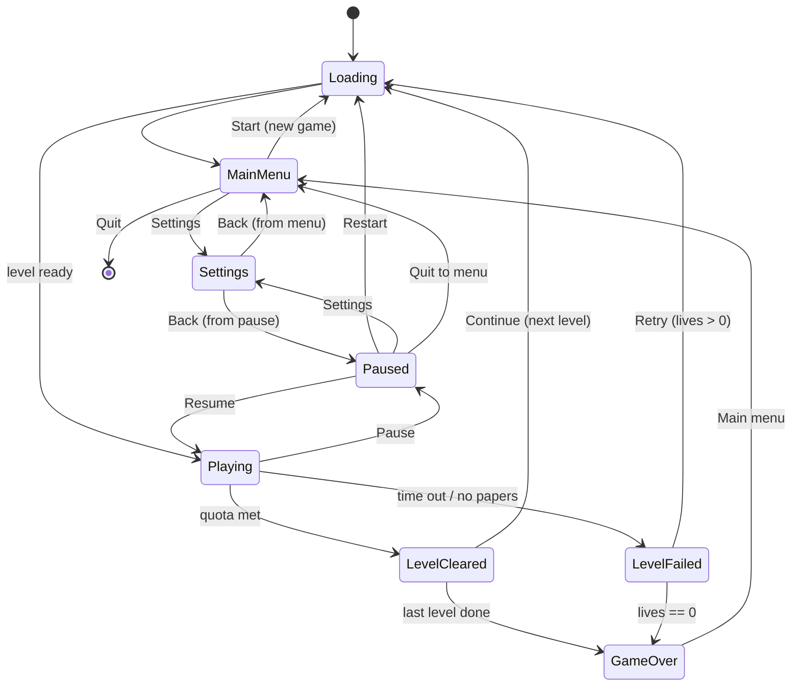

# PaperKid - a small game (design + build plan)

> Status: PLAN (not started). A vertical-slice game to exercise the game-ready runtime end to end,
> built as the tracked, committed EDITOR SAMPLE PROJECT (authored in-editor - it dogfoods the whole
> authoring stack; absorbs the week-2026-08-22 "editor sample project" seed).
> Locked decisions (2026-08-13): third-person 3D follow camera; FREE-ROAM a town block; PRIMITIVE
> blockout art. Author: Opus, from a design exchange. Opus builds; Fable reviews per phase.
>
> REFRESH (2026-08-18, user direction): this doc predated navigation + property animation + the
> run-tier scripting gap. Updated accordingly:
> - **Scripting backend = AngelScript** (NOT Wren - Wren is slated for removal; the sample must not
>   depend on it). Luau is the other surviving backend; the game's scripts are AngelScript.
> - **Run/Game tier is SCRIPTED, not native** - so it needs run-scoped messaging + scene/screen UI
>   scripting that do NOT exist yet. PREREQUISITE: `game-ready-scripting2.md` (at least P2-1 run bus;
>   P2-3/P2-4 scene.ui + reflected views for a script-driven HUD; P2-5 run.ui for the screen stack).
>   Build that track FIRST, then PaperKid on top. See "Prerequisites" below.
> - **Obstacles use NAVIGATION** (Recast/Detour agents), not hand-rolled waypoint scripts.
> - **Tells/markers/camera use PROPERTY ANIMATION** clips, not ad-hoc per-frame script lerps.
> - **Project home: TBD** - NOT the repo root; the user will name the location before scaffolding.

## Concept

Ride a bike around a town block as the paperkid. Each level gives you a stack of papers and a
countdown. Deliver to the block's subscriber houses before time runs out while avoiding traffic,
pedestrians, and street junk. Hit the delivery quota to clear the block; blocks get bigger, busier,
and tighter on time as you go. It is a small, arcade, score-chasing loop - not a sim.

## Core loop (one level)

1. Spawn at the block with N papers and a countdown timer; the HUD shows time, papers, deliveries
   (x / quota), score, lives.
2. Ride freely (steer + accelerate; third-person camera follows behind). Subscriber houses are
   MARKED (a floating marker / ground ring) so they are findable in free roam.
3. Near a subscriber, THROW a paper. A soft auto-aim biases the throw toward the house's delivery
   zone. Landing a paper in the zone = delivery (+score, +1 toward quota). Papers are limited.
4. Obstacles - moving vehicles, pedestrians, static objects (bins, hydrants, cones) - cause a CRASH
   on contact: brief knockdown + speed loss + time penalty (arcade-recoverable, not instant death).
5. Reach the delivery QUOTA before the timer hits 0 -> level cleared. Timer expires (or papers run
   out with the quota unmet) -> level failed.

## Rules

- **Deliveries:** each subscriber house has one delivery zone (porch/mailbox trigger). A paper
  entering it scores once; non-subscriber houses ignore papers (optional later: breakable windows
  for bonus, arcade-classic flavor - deferred).
- **Papers:** limited per level (e.g. quota + a margin). Out of papers with quota unmet is a soft
  fail path (timer usually ends it first).
- **Timer:** counts down only while Playing (paused/among screens it is frozen; per-scene time).
- **Crash:** knockback + ~1.5s control dampen + a few seconds off the clock. No damage model.
- **Lives:** start with 3. A level FAIL spends a life and offers Retry; 0 lives -> Game Over.
  A level CLEAR banks score and advances.
- **Score:** per delivery + a time/streak bonus on clear.
- **Progression:** an ordered level list; clear advances to the next. Difficulty ramps via level
  data (below). Finishing the last level = a win/Game Over summary.

## Screen / state machine (the backbone)

Seven screens + the in-game HUD, driven by a single game state machine. Screens are draconic.ui
game-UI overlays (actions-only); the state machine shows/hides them and gates the sim.

- **Loading:** shown during any scene load (progress/spinner); the async load boundary between states.
- **Main menu:** New Game, Settings, Quit.
- **HUD (Playing):** time, papers, deliveries x/quota, score, lives, house markers (+ optional minimap).
- **Pause:** Resume, Restart, Settings, Quit to menu. Overlays gameplay; freezes the sim + timer.
- **Level cleared:** deliveries/score/time-bonus summary; Continue.
- **Level failed:** reason (time/papers); Retry (spends a life) / Quit to menu.
- **Game over:** final score + reached level; Main menu.
- **Settings:** audio volumes (master/music/sfx), input rebind, maybe difficulty; reachable from Main
  menu AND Pause, returns to whichever opened it.

## Engine mapping (how each piece uses THIS engine)

- **Game instance:** the running game is a `GameInstance` (run host + SceneManager group +
  ActionRuntime; NetworkManager unused). The **PaperKidGame** orchestrator (state machine, score,
  lives, level index, timer, quota progress) is the **Game-tier SCRIPT** (`Game` reserved name), not a
  native manager - the whole point is to dogfood the run tier. It coordinates via the RUN bus (below).
  [[game-instance-track]] [[game-ready-scripting-spec]]
- **Messaging (the run tier):** cross-scene / game-wide coordination rides the **run-scoped EventBus**
  (`run.events.emit(name, payload)`, the Game script's `on<Event>` inbox harvests it). Within a level,
  a delivery zone's physics event -> a behavior -> `scene.events.emit` reaches that scene's Level tier;
  the Level re-emits to the run tier what the Game needs to hear (Delivered, Crashed, QuotaMet, TimeUp -
  the explicit relay pattern, no implicit scene->run bridge). The Game script advances levels via
  `run.loadScene`. NONE of `run.*` exists yet -> PREREQUISITE `game-ready-scripting2.md` P2-1/P2-2.
  [[game-ready-scripting2]]
- **State + screens:** the Game script drives the seven-screen stack. Screens + the HUD are draconic.ui
  overlays; the script reaches their roots + per-control state through `run.ui` / `scene.ui` + reflected
  views (`_hud.findByName("score").text = ...`), pushing/popping overlays via the six-op `Ui` facade.
  Pause overlays; the Game freezes the active scene's tick (per-scene time). The reflected-view + ui-root
  surface is `game-ready-scripting2.md` P2-3/P2-4/P2-5 - also PREREQUISITE. [[game-ui-subsystem]]
  [[game-ui-p1-progress]] [[game-ready-scripting2]]
- **Levels = scenes:** one scene per block, authored from prefabs (house, road tile, obstacle
  spawner). Text/XML scenes edited in-editor. [[scene-ecs-port]] [[prefabs-plan]] [[text-scenes]]
- **Player (bike):** an entity with a `CharacterComponent` (Jolt CharacterVirtual) for arcade control
  (kinematic feel, no ragdoll); a script behavior reads input actions -> steer/accelerate and the
  throw action -> `Scene.spawn` a paper. [[physics-p1]] [[script-behaviors-p1]]
- **Third-person camera:** a follow-cam entity (script behavior or small component) that trails/orbits
  behind the boy with smoothing + a look-ahead bias so upcoming obstacles read. Per-view.
- **Papers:** a paper prefab spawned on throw with an initial velocity (soft auto-aim toward the
  nearest subscriber zone in front); a physics trigger overlap with a delivery zone registers the
  delivery. [[physics-p1]]
- **Delivery zones + subscribers:** each subscriber house carries a trigger collider + a "subscriber"
  script/tag component; paper-overlap fires a physics event the game manager counts.
- **Obstacles:** vehicles/pedestrians are **navigation agents** on the block's baked NavigationZone
  (Recast/Detour - shipped), not hand-rolled waypoint scripts: pedestrians wander/patrol nav points,
  vehicles follow lane paths as agents with speed from level data. Static junk is plain colliders.
  Player-vs-obstacle collision events -> the Game's crash handler. Authoring the zone + agents in-editor
  (Bake button, zone gizmo) is itself part of the editor dogfood. [[navigation-track]]
- **Property animation:** the readable "tells" ride authored **property-animation clips**, not per-frame
  script lerps - subscriber markers pulse/bob, delivery-zone rings breathe, the crash camera-shake /
  knockdown, screen transitions, and any scripted set-dressing (a door, a swaying sign). Authored on the
  clip editor page, played from script/behavior. Exercises the property-animation runtime + editor.
  [[property-animation-takeover]]
- **Input:** a draconic.input action map - Steer (axis), Accelerate, Brake, Throw, Pause - rebindable
  from Settings. [[input-subsystem]]
- **Audio:** miniaudio - a music bus per screen/gameplay + SFX (throw, delivery ding, crash, clear,
  fail, countdown warning); volumes bound to Settings. [[audio-subsystem]]
- **Gameplay in scripts (AngelScript):** all game logic is **AngelScript** (NOT Wren - slated for
  removal; the sample must not depend on it). Lean on the game-ready scripting surface (behaviors, the
  Level tier's onStart/onUpdate/onFixedUpdate/onStop, the Game tier, Scene.spawn/find, entity events,
  physics events, coroutines, the scene + run event buses). After `game-ready-scripting2` lands, native
  code is needed only where a seam genuinely does not exist (candidate: the follow camera, if a small
  native component reads cleaner than a behavior). [[game-ready-scripting-spec]] [[scene-scripting-tier]]
  [[scripting-backend-neutrality]]
- **Testing:** run it in a `GameEditorPage` tab (play-in-editor) each phase. [[play-in-editor]]

## Content & difficulty

- **Level data** (a small per-scene settings block or data asset): time limit, delivery quota, paper
  count, block size, obstacle density + speed, pedestrian count.
- **Ramp:** L1 small block, few slow cars, generous time, low quota. Later: bigger blocks, more/faster
  vehicles, denser pedestrians, tighter time, higher quota, tighter paper margin.
- **Scope:** 3-5 hand-authored blocks reusing the same prefab kit. Blockout art throughout.

## Where it lives

The tracked, committed **editor sample project** (the week-2026-08-22 seed) - scenes + AngelScript +
authored assets, opened + played in the editor. Its exact location is TBD (the user will name it; NOT
the repo root, and distinct from the untracked `SampleGame/` Wren sketch and the user's `EditorProject/`).
If a thin native module is ever needed, per the facade rule it is its own out-of-tree module named for
the game (e.g. `PaperKid`), never `Game`; but the aim is near-zero native code - the game rides on
scripts + authored content. [[facade-pattern]]

## Prerequisites (build BEFORE PaperKid)

The scripted Game/run tier + a script-driven UI do not exist yet. `game-ready-scripting2.md` is the
gating track (greenlit 2026-08-18 as the PaperKid prerequisite), built backend-neutral (batteries on
the surviving backends - AngelScript + Luau; Wren is being retired) but FIRST consumed by PaperKid in
AngelScript:

- **P2-1 run bus + Game inbox** - the run-scoped EventBus + the Game script's `on<Event>` harvest.
  Hard-blocks P0 (the state machine is a Game script coordinating over the run bus).
- **P2-2 run facade** - `run.events.emit`, `run.loadScene*` (SceneLoader fold-in). Hard-blocks level
  progression (P3) and the boot/loading flow (P0).
- **P2-3/P2-4 scene.ui + reflected views** - a script-driven HUD (`_hud.findByName("score").text`).
  Blocks the real HUD (P1+); P0 can stand up placeholder screens via the `Ui` facade first.
- **P2-5 run.ui + ScriptName aliases** - the screen-tier root from script + clean gameplay names.
  Blocks the full screen stack (P3) and readable component names throughout.

Minimum to START PaperKid P0: P2-1 + P2-2. The UI pieces (P2-3..P2-5) can land in parallel with
PaperKid P0/P1 as the HUD/screens graduate from placeholder to script-driven.

## Phases

**P0 - Skeleton + the screen flow (the backbone first).** The `PaperKidGame` state machine +
placeholder screens for all seven states + HUD; Boot -> Loading -> Main menu -> Start -> an empty
Playing scene -> Pause -> Resume/Quit all work; Settings opens from menu + pause and returns
correctly. No gameplay yet. Proves the flow the whole game hangs on.

**P1 - The ride + deliver loop (one block).** Bike control + third-person camera; one authored block
with marked subscriber houses + delivery zones; throw + soft auto-aim + delivery scoring; timer +
quota; real Level Cleared / Level Failed transitions. The core loop is playable on one level.

**P2 - Obstacles + crash.** Vehicles + pedestrians on paths, static junk, collision -> crash effect,
limited papers, the level-data difficulty knobs. The loop gains its challenge.

**P3 - Progression + full screens + settings.** Level list + advance, lives + Game Over, real Loading
screen, and finished Main/Pause/Cleared/Failed/GameOver + Settings (audio volumes + input rebind).

**P4 - Content + juice.** 3-5 blocks on a difficulty ramp; audio (music + SFX); HUD polish (markers,
optional minimap); camera + crash feel tuning.

## Decisions

SETTLED (2026-08-18): scripting backend = **AngelScript**; Game/run tier is **scripted** (needs
`game-ready-scripting2` first); obstacles use **navigation**; tells/markers use **property animation**;
project = the tracked **editor sample project**, location TBD (user to name).

Still to confirm before building (the spec's recommendations - flip any):

- **Win condition:** delivery quota within time (recommended - no exit needed for free roam), vs
  "deliver all subscribers", vs "quota OR reach a block exit".
- **Bike control:** CharacterVirtual kinematic (recommended, tight arcade control) vs a dynamic rigid
  body (drifty, more physics tuning).
- **Crash model:** recoverable knockdown + time penalty (recommended) vs lose-a-paper vs instant fail.
- **Lives:** 3 lives + retry (recommended) vs unlimited per-level retries (score-only stakes).
- **Aim:** soft auto-aim to the nearest front subscriber (recommended for free roam) vs full manual aim.
- **Discoverability:** house markers only (recommended) vs markers + a minimap.

## What this deliberately keeps small (non-goals)

- No open city - one bounded block per level (walls/edges keep you in).
- No damage/health sim, no economy, no save profiles beyond level+score, no online.
- No bespoke art - primitives + a couple of sprites; a reskin is a later, separate pass.
- No procedural generation - blocks are hand-authored from the prefab kit.
