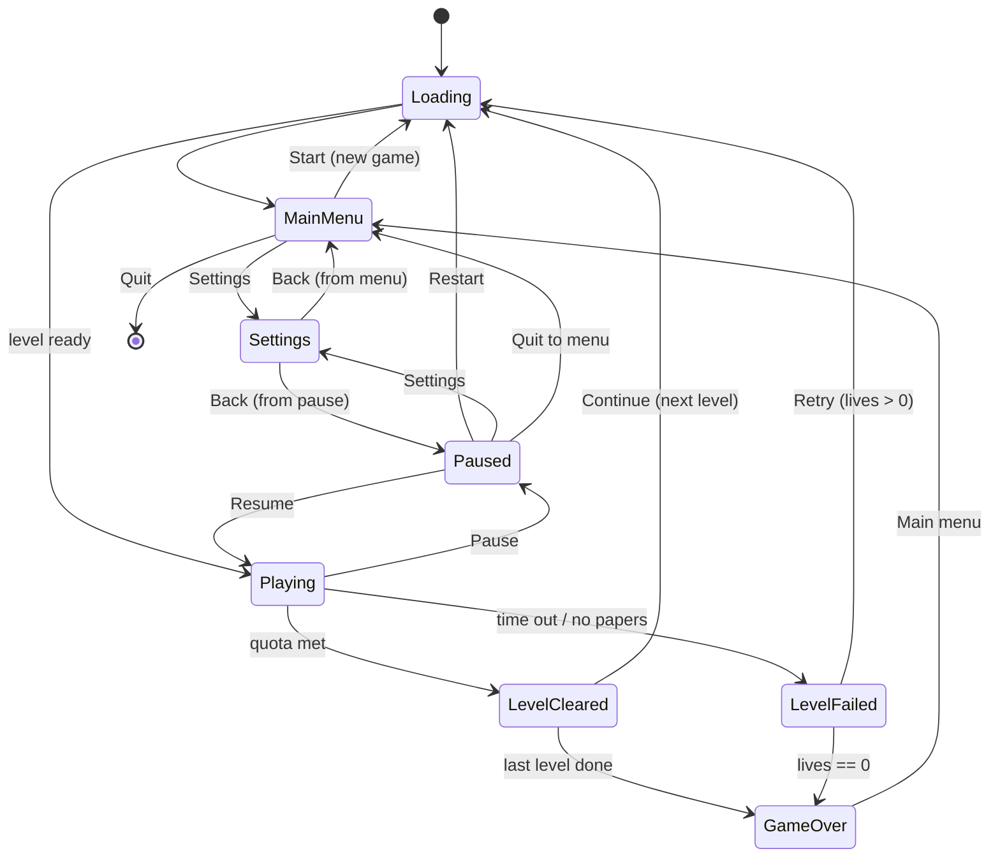

# PaperKid - a small game (design + build plan)

> Status: **P1 DONE + PLAYABLE IN-EDITOR** (2026-08-28). One block is fully playable start to finish:
> ride the bike (third-person follow cam), throw papers with soft auto-aim, deliver to subscriber houses
> up to a quota under a countdown, and see the correct Cleared / Failed screen - all in a GameEditorPage
> tab behaving like the standalone runtime. NEXT UP: P2 (obstacles + crash - nav-agent pedestrians +
> vehicles, static junk, crash-on-contact, difficulty knobs). A vertical-slice game to exercise the
> game-ready runtime end to end, built as the tracked, committed EDITOR SAMPLE PROJECT (authored
> in-editor - it dogfoods the whole authoring stack; absorbs the week-2026-08-22 "editor sample project"
> seed).
>
> P1 shipped a few engine pieces beyond the sample: Level-tier `[metadata]` script properties (real
> inspector props, not runtime fallbacks); the game-UI cook validating `<screen>` roots + the
> `ui::find*` stale-screenRoot fix; the `DebugDraw.of(scene)` script facade (used for the auto-aim arc
> preview); and the AngelScript reflected-call arg cap raised 8 -> 16 (a 9-arg facade method used to
> silently no-op). See [[game-ui-kit-track]] / [[scene-scripting-tier]] / [[debug-draw]].
> Locked decisions (2026-08-13): third-person 3D follow camera; FREE-ROAM a town block; PRIMITIVE
> blockout art. Author: Opus, from a design exchange. Opus builds; Fable reviews per phase.
>
> REFRESH (2026-08-18, user direction): this doc predated navigation + property animation + the
> run-tier scripting gap. Updated accordingly:
> - **Scripting backend = AngelScript** (NOT Wren - Wren is slated for removal; the sample must not
>   depend on it). Luau is the other surviving backend; the game's scripts are AngelScript.
> - **Run/Game tier is SCRIPTED, not native** - so it needs run-scoped messaging + scene/screen UI
>   scripting that do NOT exist yet. PREREQUISITE: `game-ready-scripting2.md` (at least P2-1 run bus;
>   P2-3/P2-4 scene.ui + reflected views for a script-driven HUD; P2-5 run.ui for the screen stack).
>   Build that track FIRST, then PaperKid on top. See "Prerequisites" below.
> - **Obstacles use NAVIGATION** (Recast/Detour agents), not hand-rolled waypoint scripts.
> - **Tells/markers/camera use PROPERTY ANIMATION** clips, not ad-hoc per-frame script lerps.
> - **Project home: `SampleProjects/PaperKid/`** - committed 2026-08-19 (skeleton: Project.xml +
>   Sources + Content/*.xasset + README + .gitignore for .cache/Cooked/Editor).

## Concept

Ride a bike around a town block as the paperkid. Each level gives you a stack of papers and a
countdown. Deliver to the block's subscriber houses before time runs out while avoiding traffic,
pedestrians, and street junk. Hit the delivery quota to clear the block; blocks get bigger, busier,
and tighter on time as you go. It is a small, arcade, score-chasing loop - not a sim.

## Core loop (one level)

1. Spawn at the block with N papers and a countdown timer; the HUD shows time, papers, deliveries
   (x / quota), score, lives.
2. Ride freely (steer + accelerate; third-person camera follows behind). Subscriber houses are
   MARKED (a floating marker / ground ring) so they are findable in free roam.
3. Near a subscriber, THROW a paper. A soft auto-aim biases the throw toward the house's delivery
   zone. Landing a paper in the zone = delivery (+score, +1 toward quota). Papers are limited.
4. Obstacles - moving vehicles, pedestrians, static objects (bins, hydrants, cones) - cause a CRASH
   on contact: brief knockdown + speed loss + time penalty (arcade-recoverable, not instant death).
5. Reach the delivery QUOTA before the timer hits 0 -> level cleared. Timer expires (or papers run
   out with the quota unmet) -> level failed.

## Rules

- **Deliveries:** each subscriber house has one delivery zone (porch/mailbox trigger). A paper
  entering it scores once; non-subscriber houses ignore papers (optional later: breakable windows
  for bonus, arcade-classic flavor - deferred).
- **Papers:** limited per level (e.g. quota + a margin). Out of papers with quota unmet is a soft
  fail path (timer usually ends it first).
- **Timer:** counts down only while Playing (paused/among screens it is frozen; per-scene time).
- **Crash:** knockback + ~1.5s control dampen + a few seconds off the clock. No damage model.
- **Lives:** start with 3. A level FAIL spends a life and offers Retry; 0 lives -> Game Over.
  A level CLEAR banks score and advances.
- **Score:** per delivery + a time/streak bonus on clear.
- **Progression:** an ordered level list; clear advances to the next. Difficulty ramps via level
  data (below). Finishing the last level = a win/Game Over summary.

## Screen / state machine (the backbone)

Seven screens + the in-game HUD, driven by a single game state machine. Screens are draconic.ui
game-UI overlays (actions-only); the state machine shows/hides them and gates the sim.

- **Loading:** shown during any scene load (progress/spinner); the async load boundary between states.
- **Main menu:** New Game, Settings, Quit.
- **HUD (Playing):** time, papers, deliveries x/quota, score, lives, house markers (+ optional minimap).
- **Pause:** Resume, Restart, Settings, Quit to menu. Overlays gameplay; freezes the sim + timer.
- **Level cleared:** deliveries/score/time-bonus summary; Continue.
- **Level failed:** reason (time/papers); Retry (spends a life) / Quit to menu.
- **Game over:** final score + reached level; Main menu.
- **Settings:** audio volumes (master/music/sfx), input rebind, maybe difficulty; reachable from Main
  menu AND Pause, returns to whichever opened it.

## Engine mapping (how each piece uses THIS engine)

- **Game instance:** the running game is a `GameInstance` (run host + SceneManager group +
  ActionRuntime; NetworkManager unused). The **PaperKidGame** orchestrator (state machine, score,
  lives, level index, timer, quota progress) is the **Game-tier SCRIPT** (`Game` reserved name), not a
  native manager - the whole point is to dogfood the run tier. It coordinates via the RUN bus (below).
  [[game-instance-track]] [[game-ready-scripting-spec]]
- **Messaging (the run tier):** cross-scene / game-wide coordination rides the **run-scoped EventBus**
  (`run.events.emit(name, payload)`, the Game script's `on<Event>` inbox harvests it). Within a level,
  a delivery zone's physics event -> a behavior -> `scene.events.emit` reaches that scene's Level tier;
  the Level re-emits to the run tier what the Game needs to hear (Delivered, Crashed, QuotaMet, TimeUp -
  the explicit relay pattern, no implicit scene->run bridge). The Game script advances levels via
  `run.loadScene`. NONE of `run.*` exists yet -> PREREQUISITE `game-ready-scripting2.md` P2-1/P2-2.
  [[game-ready-scripting2]]
- **State + screens:** the Game script drives the seven-screen stack. Screens + the HUD are draconic.ui
  overlays; the script reaches their roots + per-control state through `run.ui` / `scene.ui` + reflected
  views (`_hud.findByName("score").text = ...`), pushing/popping overlays via the six-op `Ui` facade.
  Pause overlays; the Game freezes the active scene's tick (per-scene time). The reflected-view + ui-root
  surface is `game-ready-scripting2.md` P2-3/P2-4/P2-5 - also PREREQUISITE. [[game-ui-subsystem]]
  [[game-ui-p1-progress]] [[game-ready-scripting2]]
- **Levels = scenes:** one scene per block, authored from prefabs (house, road tile, obstacle
  spawner). Text/XML scenes edited in-editor. [[scene-ecs-port]] [[prefabs-plan]] [[text-scenes]]
- **Player (bike):** an entity with a `CharacterComponent` (Jolt CharacterVirtual) for arcade control
  (kinematic feel, no ragdoll); a script behavior reads input actions -> steer/accelerate and the
  throw action -> `Scene.spawn` a paper. [[physics-p1]] [[script-behaviors-p1]]
- **Third-person camera:** a follow-cam entity (script behavior or small component) that trails/orbits
  behind the boy with smoothing + a look-ahead bias so upcoming obstacles read. Per-view.
- **Papers:** a paper prefab spawned on throw with an initial velocity (soft auto-aim toward the
  nearest subscriber zone in front); a physics trigger overlap with a delivery zone registers the
  delivery. [[physics-p1]]
- **Delivery zones + subscribers:** each subscriber house carries a trigger collider + a "subscriber"
  script/tag component; paper-overlap fires a physics event the game manager counts.
- **Obstacles:** vehicles/pedestrians are **navigation agents** on the block's baked NavigationZone
  (Recast/Detour - shipped), not hand-rolled waypoint scripts: pedestrians wander/patrol nav points,
  vehicles follow lane paths as agents with speed from level data. Static junk is plain colliders.
  Player-vs-obstacle collision events -> the Game's crash handler. Authoring the zone + agents in-editor
  (Bake button, zone gizmo) is itself part of the editor dogfood. [[navigation-track]]
- **Property animation:** the readable "tells" ride authored **property-animation clips**, not per-frame
  script lerps - subscriber markers pulse/bob, delivery-zone rings breathe, the crash camera-shake /
  knockdown, screen transitions, and any scripted set-dressing (a door, a swaying sign). Authored on the
  clip editor page, played from script/behavior. Exercises the property-animation runtime + editor.
  [[property-animation-takeover]]
- **Input:** a draconic.input action map - Steer (axis), Accelerate, Brake, Throw, Pause - rebindable
  from Settings. [[input-subsystem]]
- **Audio:** miniaudio - a music bus per screen/gameplay + SFX (throw, delivery ding, crash, clear,
  fail, countdown warning); volumes bound to Settings. [[audio-subsystem]]
- **Gameplay in scripts (AngelScript):** all game logic is **AngelScript** (NOT Wren - slated for
  removal; the sample must not depend on it). Lean on the game-ready scripting surface (behaviors, the
  Level tier's onStart/onUpdate/onFixedUpdate/onStop, the Game tier, Scene.spawn/find, entity events,
  physics events, coroutines, the scene + run event buses). After `game-ready-scripting2` lands, native
  code is needed only where a seam genuinely does not exist (candidate: the follow camera, if a small
  native component reads cleaner than a behavior). [[game-ready-scripting-spec]] [[scene-scripting-tier]]
  [[scripting-backend-neutrality]]
- **Testing:** run it in a `GameEditorPage` tab (play-in-editor) each phase. [[play-in-editor]]

## Content & difficulty

- **Level data** (a small per-scene settings block or data asset): time limit, delivery quota, paper
  count, block size, obstacle density + speed, pedestrian count.
- **Ramp:** L1 small block, few slow cars, generous time, low quota. Later: bigger blocks, more/faster
  vehicles, denser pedestrians, tighter time, higher quota, tighter paper margin.
- **Scope:** 3-5 hand-authored blocks reusing the same prefab kit. Blockout art throughout.

## Where it lives

The tracked, committed **editor sample project** (the week-2026-08-22 seed) - scenes + AngelScript +
authored assets, opened + played in the editor. Committed at **`SampleProjects/PaperKid/`** (2026-08-19),
distinct from the untracked `SampleGame/` Wren sketch and the user's `EditorProject/`.
If a thin native module is ever needed, per the facade rule it is its own out-of-tree module named for
the game (e.g. `PaperKid`), never `Game`; but the aim is near-zero native code - the game rides on
scripts + authored content. [[facade-pattern]]

## Prerequisites (build BEFORE PaperKid)

The scripted Game/run tier + a script-driven UI do not exist yet. `game-ready-scripting2.md` is the
gating track (greenlit 2026-08-18 as the PaperKid prerequisite), built backend-neutral (batteries on
the surviving backends - AngelScript + Luau; Wren is being retired) but FIRST consumed by PaperKid in
AngelScript:

- **P2-1 run bus + Game inbox** - the run-scoped EventBus + the Game script's `on<Event>` harvest.
  Hard-blocks P0 (the state machine is a Game script coordinating over the run bus).
- **P2-2 run facade** - `run.events.emit`, `run.loadScene*` (SceneLoader fold-in). Hard-blocks level
  progression (P3) and the boot/loading flow (P0).
- **P2-3/P2-4 scene.ui + reflected views** - a script-driven HUD (`_hud.findByName("score").text`).
  Blocks the real HUD (P1+); P0 can stand up placeholder screens via the `Ui` facade first.
- **P2-5 run.ui + ScriptName aliases** - the screen-tier root from script + clean gameplay names.
  Blocks the full screen stack (P3) and readable component names throughout.

**STATUS (2026-08-19): P2-1 + P2-2 are DONE** (run bus + Game inbox; the `run` facade -
`run.events()` / `run.loadSceneAsync` + the `run` alias, in-tree). The screen-tier UI-from-script
surface is ALSO shipped (the `ui` facade + reflected View handles + `ScreenStack` + gamekit widgets),
so **PaperKid P0 is UNBLOCKED**. `scene.ui` (P2-3) stays deferred but PaperKid does not need it - the
HUD and all seven screens ride the SCREEN tier. Remaining P2-5 loose ends (ScriptName component-alias
sweep; delete the SceneLoader alias) are cleanup, not blockers.

## Current state (what is DONE, so a fresh session can resume)

**P0 is complete and playable in a GameEditorPage tab.** Verified flow: boot -> Main menu; New Game
loads MainScene (the scene actually switches AND renders in-editor); Settings opens from the menu and
returns; Quit ends the play session; ESC toggles a Pause overlay over the running scene and Resume
drops it. Play-in-editor now behaves like the standalone runtime, which was the explicit goal.

### Engine seams built this session to make P0 work (all committed, both compilers green)

These were NOT pre-existing - PaperKid P0 drove them out. A fresh session building P1+ can rely on them:

- **`button.onClick(Action(this.method))` seam** - `Screen.findButton(id)` returns a view handle; its
  `.onClick(handler)` takes an AngelScript `Action` funcdef wrapping a global fn OR a method delegate
  (`Action(this.onStartGame)`). Method-delegate extraction from the `?&in IScriptDelegate` arg was
  broken (GETOBJREF vs GETREF indirection) and is fixed (commit `624c56ee`).
- **`run::requestExit(code)`** - a Game script can end the run; in-editor it stops the play session,
  standalone it exits the app (`2cf84197`, via `IApplicationHost::RequestExit`).
- **Play-in-editor renders + FOLLOWS the instance's scene** - `GameEditorPage` now (a) draws the game
  screen-tier UI overlay (`b8711e3a`, was fetching RenderSubsystem from the wrong context), and (b)
  calls `FollowInstanceScene()` each update: adopts `m_gameInstance->GetScene()` when it changes,
  retires the outgoing scene (Stop + DestroyScene), honors pause, and **calls `EnsureCamera(*m_scene)`
  on the adopted scene** - a scene loaded via `run::loadScene` may ship no camera, and without a default
  one RenderScene draws nothing and the old frame lingers (`3f049890`). `GameInstance::ClearScenes()`
  drops in-flight tracked loads before clearing (post-Stop PumpScriptLoads UAF fix, same commit).
- **Editor wires the embedded app's content DB** - `run::loadScene` guards on a content DB + Resources;
  the editor now sets `m_embeddedApp->SetContentDatabase(&m_project->SourceDb())` at project open and
  clears it at close (`415c2545`). Without this, `loadScene` returned false in-editor and the scene
  never switched.
- **UI docs/themes store source as a linked `Sources/` file** like scripts (`3dd2e39d`); the editor
  UIDocumentPage edits the linked source. `.sml` = document, `.sss` = theme.
- **UI button-dispatch hardened against a self-destroying target** - `RefPtr` pins in FireClick +
  dispatch so a handler that rebuilds/frees its own view mid-click can't UAF (`f60e087f`).
- **InputMapPage: Listen-click crash fixed + Escape is bindable** (`bc79810d`) - BeginListen uses
  `RequestRebuild()` not inline `Rebuild()`; the Listen button toggles to "Cancel" while listening;
  Escape is no longer swallowed as cancel, so it can be bound. (User bound Pause->ESC in the map.)

### Ground-truth project inventory (SampleProjects/PaperKid/)

- **Project.xml:** `defaultSceneId` = StartScene `c83b3435-c2a2-4224-9778-35736dd26221` (boot scene);
  `startupScriptId` = PaperKidGame `6c8ed2f6-fa3f-4265-87b7-9365e2d6022c`; input map
  `286f2ecc-...`; bus layout `5be7a51f-...`; UI font Roboto `997e2b40-...`; no UI theme yet
  (`defaultUiThemeId` all-zero); no `loadingDocumentId` yet; no `nativeModule` (zero native code).
- **Sources/:** `PaperKidGame.as` (the Game tier), `main-menu.sml`, `pause.sml`, `settings.sml`,
  `Roboto-Regular.ttf`. (Cooked envelopes: `Content/UI/{main-menu,pause,settings}.xasset`.)
- **Scenes:** `StartScene` (boot; guid `c83b3435-...`) and `MainScene` (the "Playing" level; guid
  `855ffed4-4da7-4fa0-9756-a95c6c842890`). Both internally named "Scene". Both currently near-empty
  (no camera shipped -> EnsureCamera covers it). `.scene.bin` sidecar + `.xasset` envelope each.
- **Meshes:** `Cube`, `Plane`, `Sphere` (the blockout primitive kit). **Audio:** DefaultAudioBusLayout.
- **Input map (`DefaultInputMap`, set "Gameplay", priority 0):** actions `Move` (axis2d), `Look`
  (axis2d), `Jump` (button), `Fire` (button), `Pause` (button, bound to keycode 62 = ESC). Only Pause
  is bound today; Move/Look/Jump/Fire are declared but UNBOUND - P1 wires them (Move->WASD, Fire->Throw
  key, etc., and likely renames toward Steer/Accelerate/Brake/Throw).

### Recipes + gotchas a fresh session MUST know before touching PaperKid

- **Script facade call syntax:** static facades use scope resolution - `run::loadScene(guid)`,
  `run::requestExit()`, `ui::push(guid)`, `ui::pop()`, `ui::clear()`, `Input::wasPressed("Pause")`,
  `Log::info(...)`. Value handles use dot: `menu.findButton("start-btn").onClick(...)`. [[script-facade-call-syntax]]
- **Guids in scripts:** `Guid(high, low)` - the two u64 halves of the UUID (first 8 bytes = high, last
  8 = low). There is NO string Guid ctor / load-by-name for scripts. Every guid literal in the script
  MUST match its `.xasset` envelope. See the header of `PaperKidGame.as` for the live table.
- **Input is action-based:** an action fires only if it EXISTS in the map AND is in the active set. New
  gameplay inputs (Throw, Steer, ...) must be added to the input map before the script can read them.
- **A `run::loadScene`d scene needs a camera** or nothing renders - author one into the scene, or rely
  on EnsureCamera (P0's crutch). P1 should author a real camera / follow-cam rig into MainScene.
- Screens are UIDocuments authored in `.sml` (linked `Sources/` source), pushed by guid via `ui::push`;
  id-tagged controls (`<Button id="start-btn"/>`) are found with `findButton(id)`.
- Editor font is codepoints <=255 (ASCII/Latin-1) - stick to ASCII in UI text. [[editor-font-glyph-range]]

## Phases (overview)

- **P0 - DONE.** Skeleton + screen flow: PaperKidGame state machine + Main/Pause/Settings screens; boot
  -> menu -> New Game (loads + renders MainScene) -> Pause/Resume/Quit; Settings round-trips. No gameplay.
- **P1 - DONE (2026-08-28).** The ride + deliver loop (one block): bike control + third-person camera; one
  authored block with marked subscriber houses + delivery zones; throw + soft auto-aim + delivery scoring;
  timer + quota; real Level Cleared / Level Failed transitions. Shipped BEYOND the plan: an overlay HUD
  (timer / deliveries / papers), an out-of-papers fail (with in-flight grace), and a DebugDraw auto-aim
  arc preview. Core loop playable on one level.
- **P2 - NEXT. Obstacles + crash.** Vehicles + pedestrians as nav agents, static junk, collision -> crash
  effect, limited papers, the level-data difficulty knobs. The loop gains its challenge.
- **P3 - Progression + full screens + settings.** Level list + advance, lives + Game Over, real
  Loading screen, finished Cleared/Failed/GameOver + Settings (audio volumes + input rebind).
- **P4 - Content + juice.** 3-5 blocks on a difficulty ramp; audio (music + SFX); HUD polish (markers,
  optional minimap); camera + crash feel tuning.

## Detailed build plan (remaining work, fresh-session-executable)

Each step lists the assets to author, the scripts to write, the engine seams it rides, and how to
verify. Author everything in-editor (dogfood), test each slice in a GameEditorPage tab. Land with tests
where a native/engine change is involved; commit in logical pieces; verify DEBUG on build/clang AND
build/gcc before committing. [[tests-required-for-additions]] [[dev-build-config]]

### P1 - The ride + deliver loop (one block)

Goal: one hand-authored block is fully playable - ride, find marked subscriber houses, throw papers,
score deliveries, meet a quota before a timer, and hit real Cleared/Failed screens.

> **STATUS: P1 COMPLETE (2026-08-28).** All of P1-1..P1-7 shipped (block authored; Bike control +
> FollowCamera; Subscriber houses/zones; throw + soft auto-aim; Level tier + Game scoring; HUD +
> Cleared/Failed screens). PLUS beyond-plan extras: an overlay HUD (`hud.sml`, timer/deliveries/papers),
> an out-of-papers fail with an in-flight grace window, and a `DebugDraw.of(scene)` auto-aim arc preview.
> The per-item notes below are kept as the build record.

**P1-1 Author the block scene (MainScene). [AUTHORING - in-editor]** In the scene editor, build one
50x50 block (a ground `Plane`, four `Cube` perimeter walls, one central `Cube` building to lap), a real
**camera** entity (disable P0's EnsureCamera crutch - MainScene owns its camera, driven by the
follow-cam), and a directional light. Concrete blockout reference (primitives are UNIT-sized/centered,
so visual size = scale; Y-up, +Z = the bike's initial facing, ground surface at Y=0; RigidBody carries
its OWN box, so set halfExtents = scale/2):

| Entity    | Mesh  | Position (x,y,z)  | Scale (x,y,z) | Components / key fields |
|-----------|-------|-------------------|---------------|-------------------------|
| Ground    | Plane | (0, 0, 0)         | (52, 1, 52)   | RigidBody: motion=Static, layer=Static, shape=Plane |
| Wall N    | Cube  | (0, 1.5, 25)      | (52, 3, 1)    | RigidBody Static Box, halfExtents (26, 1.5, 0.5) |
| Wall S    | Cube  | (0, 1.5, -25)     | (52, 3, 1)    | RigidBody Static Box, halfExtents (26, 1.5, 0.5) |
| Wall E    | Cube  | (25, 1.5, 0)      | (1, 3, 52)    | RigidBody Static Box, halfExtents (0.5, 1.5, 26) |
| Wall W    | Cube  | (-25, 1.5, 0)     | (1, 3, 52)    | RigidBody Static Box, halfExtents (0.5, 1.5, 26) |
| Building  | Cube  | (0, 3, 0)         | (12, 6, 12)   | RigidBody Static Box, halfExtents (6, 3, 6) |
| Bike      | Cube  | (-18, 0.9, -20)   | (0.8,1.6,1.8) | CharacterComponent (defaults) + ScriptBehavior -> Bike.xasset class `Bike` |
| Camera    | -     | (-18, 4, -27)     | (1, 1, 1)     | Camera + ScriptBehavior -> FollowCamera class `FollowCamera`, target = Bike; rotation quat (0, 0.9784, 0.2069, 0) = yaw 180 + pitch ~24 down, so the STATIC camera frames the Bike |
| Sun       | -     | (0, 10, 0)        | (1, 1, 1)     | Directional Light, rotationEuler ~ (-50, -30, 0) |

Bike Y=0.9 = capsule (radius 0.35 + halfHeight 0.55) resting on the ground; the cube visual is
cosmetic, the capsule collides. CAMERA FORWARD IS -Z (engine convention: an entity's/camera's forward
is its local -Z, RenderComponents.cppm "Directional uses the entity's forward (-Z)"). So an UNROTATED
camera placed behind the bike (more-negative Z) looks AWAY from it - the camera needs a rotation to
face the Bike. At runtime FollowCamera aims it (snaps behind on frame 1, so its spawn rotation is
approximate); the authored rotation above only matters for the STATIC editor preview (author it so
authoring frames the bike, not empty space).
Verify: New Game shows the block. (Houses/roads come with P1-4.)

**P1-2 Player bike entity + control behavior. [CODE DONE; AUTHORING pending]** `CharacterComponent`
(Jolt CharacterVirtual, kinematic arcade feel - decided, no ragdoll). `Bike.as` written
(`SampleProjects/PaperKid/Sources/Bike.as` + `Content/Scripts/Bike.xasset`): `onUpdate(dt)` reads the
`Move` axis (Y = throttle/brake, X = steer), ramps a signed speed, turns a heading, and drives the
character along it via the reflected `Quaternion::FromAxisAngle`/`RotateVector`; tunables are
`[metadata]` inspector properties. Input map wired: `DefaultInputMap.xasset` = Move (Axis2D WASD),
Throw (Space), Pause (Escape). Cook-tested against the full engine surface (Script.AngelScript.Pipeline
tests). Verify (in-editor): drive the bike around the block. [[physics-p1]] [[script-behaviors-p1]]
[[input-subsystem]]

**P1-3 Third-person follow camera. [CODE DONE; AUTHORING pending]** `FollowCamera.as` written
(`SampleProjects/PaperKid/Sources/FollowCamera.as`) as an AngelScript behavior on the camera entity:
the target is an `[null] Entity@` PICKER property (no name lookup), springs the camera behind-and-above
(behind = the camera's own lag, so no need to read the bike heading), and aims with reflected
`Math::Atan2`/`Asin`. Native component NOT needed (the behavior reads clean). Cook-tested. Verify
(in-editor): camera follows smoothly, upcoming obstacles read. [[facade-pattern]]

**P1-4 Subscriber houses + delivery zones (ZERO native).** Per the locked marking decision: a
subscriber house carries a `Subscriber.as` **behavior** (its presence IS the mark; per-house data =
authored behavior fields). Add an `isTrigger` collider = the delivery zone. The visible marker is a
child mesh (later driven by a property-animation clip in P4). Papers ride their own **physics group** so
the trigger fires only for papers (no name-sniffing). `Subscriber.onTriggerEnter(other)` ->
`scene.events.emit("Delivered", <payload>)`. Verify: walking a test collider into a zone logs a
delivery. [[physics-p1]]

**P1-5 Throw + papers + soft auto-aim.** `Throw` action in `Bike.as` -> `Scene.spawn` a **paper
prefab** (a small `Cube`/`Sphere` with a collider on the papers physics group) with an initial velocity;
soft auto-aim biases the velocity toward the nearest subscriber delivery zone IN FRONT of the bike.
Papers are limited per level. Verify: throwing lands papers; a paper entering a zone registers once.

**P1-6 The Level tier relay + Game scoring.** Author a **Level-tier script** on MainScene
(onStart/onUpdate/onStop): it owns the countdown timer (ticks only while Playing - per-scene time),
tracks papers remaining, and RE-EMITS to the run bus what the Game needs: `Delivered`, `QuotaMet`,
`TimeUp`, `OutOfPapers` (explicit relay - no implicit scene->run bridge). Extend the **Game** script
(`PaperKidGame.as`) with `on<Delivered>` / `on<QuotaMet>` / `on<TimeUp>` inbox handlers: count toward
quota + score, and drive state to LevelCleared / LevelFailed. Verify: meeting the quota before time ->
Cleared; timer 0 (or out of papers, quota unmet) -> Failed. [[scene-scripting-tier]]
[[game-ready-scripting-spec]]

**P1-7 A minimal HUD + Cleared/Failed screens.** Add a HUD UIDocument (`Sources/hud.sml`): time,
papers, deliveries x/quota, score. Drive its labels from script via reflected View handles
(`hud.findByName("score").text = ...`). Author `level-cleared.sml` + `level-failed.sml` screens (with a
Continue / Retry / Quit button each) and wire them like the P0 screens. Verify: HUD updates live; the
end screens appear on the right transition. [[game-ui-subsystem]] [[game-ui-p1-progress]]

**P1 acceptance: MET (2026-08-28).** One level is fully playable start to finish - ride, deliver to quota
under a timer, see the correct Cleared/Failed screen. Camera + throw feel is rough (juice is P4).

### P2 - Obstacles + crash

Goal: the loop gains challenge - moving hazards, a crash penalty, limited papers made to matter, and the
per-level difficulty knobs.

**P2-1 Bake a NavigationZone on the block.** In-editor: place the NavigationZone, Bake (dogfood the
nav authoring - zone gizmo + Bake button). Verify the navmesh covers the drivable/walkable area.
[[navigation-track]]

**P2-2 Pedestrians as nav agents.** A `Pedestrian.as` behavior on an agent entity: wander/patrol nav
points at a data-driven speed. Spawn a few via a spawner or authored placement. Verify: pedestrians
walk the block on the navmesh.

**P2-3 Vehicles as nav agents on lane paths.** A `Vehicle.as` behavior: follow authored lane paths as
an agent, speed from level data. Verify: cars drive their lanes.

**P2-4 Static junk.** Bins/hydrants/cones = plain `Cube`/`Cylinder` colliders (no behavior). Place a
few. Verify: they block the bike.

**P2-5 Crash on contact.** Player-vs-obstacle collision events (`onContactBegin`) -> the bike emits
`Crashed` -> Level relays -> Game applies the crash model: knockback + ~1.5s control dampen + a few
seconds off the clock (recoverable knockdown, NO damage model - decided). Verify: hitting a car/ped/junk
crashes recoverably and docks time. [[physics-p1]]

**P2-6 Level-data difficulty knobs.** A per-scene settings block (or small data asset): time limit,
delivery quota, paper count, block size, obstacle density + speed, pedestrian count. The Level script
reads it on onStart. Verify: changing the data changes the level's difficulty without code edits.

**P2 acceptance:** the one block is now a real arcade challenge - dodge traffic + pedestrians, papers
are scarce, crashes cost time; all difficulty comes from level data.

### P3 - Progression + full screens + settings

Goal: multiple levels chained, lives + Game Over, and every screen finished for real (including
Settings with working audio volumes + input rebind).

**P3-1 Level list + advance.** The Game script holds an ordered level list (scene guids) + a current
index. LevelCleared -> Continue -> `run::loadScene(next)` -> Loading -> Playing. Last level cleared ->
GameOver (win summary). Verify: clearing L1 advances to L2.

**P3-2 Lives + retry + Game Over.** Start with 3 lives. LevelFailed spends a life; Retry (lives>0) ->
reload the same level; 0 lives -> GameOver. Author `game-over.sml` (final score + reached level + Main
menu button). Verify: fail 3x -> Game Over; Retry replays the level.

**P3-3 Real Loading screen.** Author a Loading UIDocument (progress/spinner) shown across every async
scene-load boundary; set Project.xml `loadingDocumentId`. The Game pushes it on load start, pops on
level ready. Verify: a load shows the Loading screen, not a frozen frame.

**P3-4 Finish Settings - audio volumes.** Settings screen sliders for master/music/sfx bound to the
audio bus layout; persist to per-project settings. Verify: changing a slider changes volume live and
survives a restart. [[audio-subsystem]]

**P3-5 Finish Settings - input rebind.** Reuse the InputMapPage rebind surface (Listen/Cancel, now
crash-free) or a game-side rebind screen for Steer/Accelerate/Brake/Throw/Pause. Verify: rebinding a
key takes effect in gameplay. [[input-subsystem]]

**P3-6 Polish all seven screens.** Main / Pause / Settings / Loading / LevelCleared / LevelFailed /
GameOver: consistent theme (author a `.sss` theme, set `defaultUiThemeId`), correct back-navigation
(Settings returns to menu OR pause per `m_settingsReturn`, already handled). Verify: every state
transition in the state-machine diagram works both directions.

**P3 acceptance:** a full run from Main menu through several levels to a win or Game Over, with working
Settings, matches the state machine at the top of this doc.

### P4 - Content + juice

Goal: enough content for a real difficulty arc, sound, and the "tells" + feel that make it read as a
game rather than a tech demo.

**P4-1 3-5 blocks on a difficulty ramp.** Hand-author 3-5 scenes from the same prefab kit; tune each
one's level-data (L1 small/slow/generous -> later bigger/busier/tighter). Add them to the Game's level
list in order. Verify: difficulty ramps sensibly across the set.

**P4-2 Audio.** miniaudio: a music bus per screen/gameplay + SFX (throw, delivery ding, crash, clear,
fail, countdown warning). Volumes already bound to Settings (P3-4). Verify: each event has sound;
volumes obey Settings. [[audio-subsystem]]

**P4-3 Property-animation "tells."** Author property-animation clips (on the clip editor page) and play
them from script/behavior: subscriber markers pulse/bob, delivery-zone rings breathe, crash
camera-shake / knockdown, screen transitions, incidental set-dressing (a door, a swaying sign). NO
per-frame script lerps - clips. Verify: the tells read; a first-time player finds houses + feels crashes.
[[property-animation-takeover]]

**P4-4 HUD polish + camera/crash feel tuning.** Finalize HUD (clear markers; optional minimap is a
stretch - decided against for core, revisit only if houses are hard to find). Tune follow-cam smoothing
+ look-ahead and the crash knockback/dampen curve until the ride feels good. Verify: the game is fun to
play through once, front to back.

**P4 acceptance:** a complete, juiced vertical slice - 3-5 blocks, sound, readable tells, good feel -
that exercises the whole game-ready runtime (the original point of the exercise).

## Decisions

SETTLED (2026-08-18): scripting backend = **AngelScript**; Game/run tier is **scripted** (needs
`game-ready-scripting2` first); obstacles use **navigation**; tells/markers use **property animation**;
project = the tracked **editor sample project** (committed at `SampleProjects/PaperKid/`).

SETTLED (2026-08-19, all six recommendations taken by the user):

- **Win condition:** delivery quota within time (no exit needed for free roam).
- **Bike control:** CharacterVirtual kinematic (tight arcade control, no ragdoll).
- **Crash model:** recoverable knockdown + time penalty (no damage model).
- **Lives:** 3 lives + retry; 0 lives -> Game Over.
- **Aim:** soft auto-aim to the nearest front subscriber.
- **Discoverability:** house markers only (no minimap).

SETTLED (2026-08-19, marking mechanism - **ZERO native code**): a subscriber house is an entity
carrying a `Subscriber` AngelScript **behavior** (its presence IS the mark; per-house data = the
behavior's editor-authored fields; the visible marker is a child mesh driven by a property-animation
clip). The **delivery zone** is an `isTrigger` collider on that house, handled by the behavior's
`onTriggerEnter(other)`; papers ride their own **physics group** so the trigger fires only for papers
(no name-sniffing). On overlap: `scene.events.emit("Delivered")` -> the Level tier relays to the run
bus -> the Game script counts it toward quota. Behaviors-carry-authored-fields plus `onTriggerEnter` /
`onContactBegin` are shipped and tested on BOTH backends; the only native *candidate* in the whole
game is the follow-camera (and it can start as a behavior). No native-module infrastructure required -
if that ever changes it is a finding we stop and discuss, not silent scope creep.

## What this deliberately keeps small (non-goals)

- No open city - one bounded block per level (walls/edges keep you in).
- No damage/health sim, no economy, no save profiles beyond level+score, no online.
- No bespoke art - primitives + a couple of sprites; a reskin is a later, separate pass.
- No procedural generation - blocks are hand-authored from the prefab kit.
