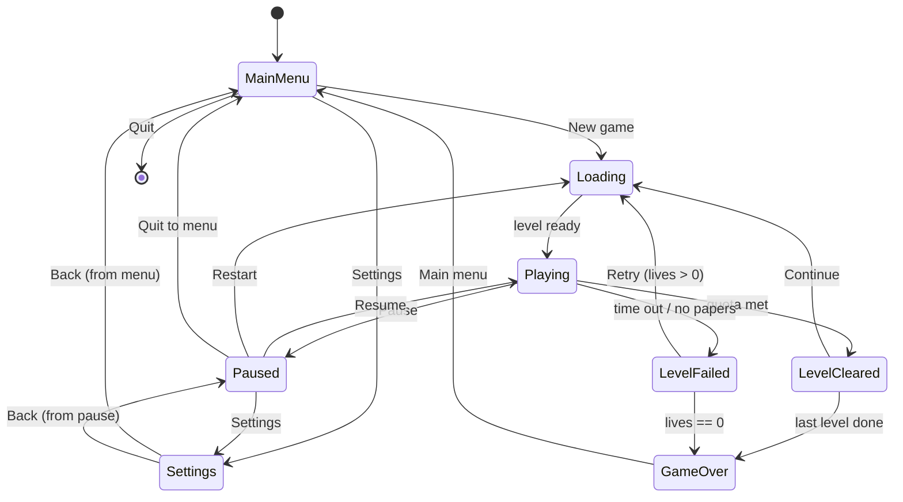

# PaperKid - a small arcade game, rebuilt through the MCP

> STATUS: PROPOSED 2026-10-02, a REWRITE of the 2026-08-13 spec (that one is in git history,
> last at 6a44119d). The first PaperKid was built from 2026-08-19 before the MCP tools could
> author a game, and stopped after one playable block (its P1). Sky Hopper has since been
> built, played through and shipped to a Steam Deck entirely through the MCP tools; PaperKid
> is rebuilt the same way, from nothing, in an external project, and replaces the tracked one
> once it is complete. The game design below is the first spec's, kept; the engine mapping is
> new, written against today's facades and tools. One change to the design (user 2026-10-01):
> a minimap, which the first spec ruled out, built on the render-textures branch. Read
> CONVENTIONS.md first.

## Where it lives and how it is built

- **External project**: `~/Dev/RaptorProjects/PaperKid`, its own local git repository (as Sky
  Hopper's `~/Dev/RaptorProjects/SkyHopper` is). Created with `project_create`, then opened in
  the editor with `--mcp`; everything after is MCP calls.
- **Through the tools, not by hand.** Assets by `asset_create` / `asset_import`, scenes by
  `scene_write` (validated with `scene_validate`), scripts by `script_create` and
  `script_validate`, settings by `project_settings_set`, playtests by `pie_start` / `pie_run` /
  `pie_screenshot`. A tool that is missing or wrong is a finding: fix it in the engine, with a
  test, on its own commit (AGENTS.md "Agent tooling"), then carry on.
- **Replacing the tracked project.** When P4 is accepted, `Data/SampleProjects/PaperKid` is
  replaced by the new project's sources (not its `Cooked/`, `.cache/`, `Editor/`, `Dist/`),
  with `CREDITS.md` and `Licenses/` if anything third-party went in, a README in Sky Hopper's
  shape with a screenshot, and `Integration.Mcp`'s PaperKid expectations
  (`SampleProjectTests.cpp`, today `{23, 20, 3}`) updated to the new counts.

## Concept

Ride a bike around a town block as the paperkid. Each level gives you a stack of papers and a
countdown. Deliver to the block's subscriber houses before time runs out while avoiding
traffic, pedestrians and street junk. Hit the delivery quota to clear the block; blocks get
bigger, busier and tighter on time as you go. A small, arcade, score-chasing loop, not a sim.

## Core loop (one level)

1. Spawn at the block with N papers and a countdown; the HUD shows time, papers, deliveries
   (x / quota), score, lives, and the minimap.
2. Ride freely (steer and accelerate; a third-person camera follows behind). Subscriber houses
   are marked in the world (a floating marker) and on the minimap (a dot).
3. Near a subscriber, throw a paper. A soft auto-aim biases the throw toward the nearest
   subscriber's delivery zone in front. A paper landing in the zone is a delivery (score, +1 to
   quota). Papers are limited.
4. Obstacles (cars, pedestrians, bins, hydrants, cones) cause a crash on contact: a brief
   knockdown, speed lost, a few seconds off the clock. Recoverable, not instant death.
5. Reach the quota before the timer hits 0 and the level is cleared. The timer runs out, or the
   papers do with the quota unmet, and the level is failed.

## Rules

- **Deliveries**: each subscriber house has one delivery zone (a porch trigger). A paper
  entering it scores once; other houses ignore papers.
- **Papers**: limited per level (the quota plus a margin). Out of papers with the quota unmet
  fails the level once the papers in flight have landed.
- **Timer**: counts down only while playing (frozen when paused or between screens).
- **Crash**: knockback, about 1.5 s of dampened control, a few seconds off the clock.
- **Lives**: 3. A failed level spends a life and offers a retry; 0 lives is Game Over. A cleared
  level banks its score and moves on.
- **Score**: per delivery, plus a time and streak bonus on clear.
- **Progression**: an ordered level list; clearing the last is a win summary.

## Screens (the state machine)

```mermaid
stateDiagram-v2
    [*] --> MainMenu
    MainMenu --> Loading: New game
    MainMenu --> Settings: Settings
    MainMenu --> [*]: Quit
    Loading --> Playing: level ready
    Playing --> Paused: Pause
    Paused --> Playing: Resume
    Paused --> Loading: Restart
    Paused --> Settings: Settings
    Paused --> MainMenu: Quit to menu
    Playing --> LevelCleared: quota met
    Playing --> LevelFailed: time out / no papers
    LevelCleared --> Loading: Continue
    LevelCleared --> GameOver: last level done
    LevelFailed --> Loading: Retry (lives > 0)
    LevelFailed --> GameOver: lives == 0
    GameOver --> MainMenu: Main menu
    Settings --> MainMenu: Back (from menu)
    Settings --> Paused: Back (from pause)
```

Main menu (New game, Settings, Quit); HUD; Pause (Resume, Restart, Settings, Quit to menu);
Level cleared (deliveries, score, bonus; Continue); Level failed (reason; Retry or Quit);
Game over (final score, level reached); Settings (master, music and effect volumes; back to
whichever opened it). Keyboard and gamepad drive every screen, as in Sky Hopper.

## Engine mapping (today's surface)

What exists is cited by what Sky Hopper ships with (`Data/SampleProjects/PlatformerGame`),
which uses all of it through the MCP; the exact signatures come from `script_api`.

- **Game tier** (`PaperKidGame.as`, the project's startup script): the state machine, score,
  lives, level index; screens through `ui::push` / `ui::pop` / `ui::clear` and the typed
  finders; levels through `run::loadScene`; pause through `run::setTimeScale(0)`; quit through
  `run::requestExit`. Sky Hopper's `PlatformerGame.as` is the model.
- **Level tier** (one Level script per block): the countdown, papers left, the delivery count,
  and the relay of `Delivered` / `Crashed` / `QuotaMet` / `TimeUp` / `OutOfPapers` to the Game
  through the run's events. Level data (time limit, quota, papers, traffic speed, pedestrian
  count) are the Level script's properties, so each block's scene carries its own numbers.
- **The bike**: a `CharacterComponent` driven by a behavior (`Bike.as`) reading the input map's
  actions (Steer, Throttle, Brake, Throw, Pause); a follow camera behavior as Sky Hopper's
  `FollowCamera.as`.
- **Papers**: a `Paper` prefab (a small box with a rigid body on its own physics group),
  spawned by `ScenePrefabs::of(scene).spawn(...)` with an impulse along the auto-aimed arc.
- **Subscribers**: a `Subscriber.as` behavior on the house (its presence is the mark) with an
  `isTrigger` collider as the delivery zone, taking `onTriggerEnter` from the papers' group
  only; a child marker mesh animated by a property-animation clip (`SceneAnimation`).
- **Obstacles**: pedestrians and cars are navigation agents (`NavAgentComponent`: `navigate`,
  `setSpeed`, `finished`) on the block's baked navigation zone; pedestrians wander between
  points, cars loop lane waypoints. Static junk is plain colliders. A crash is the bike's
  `onContactBegin` with an obstacle's group.
- **The minimap** (render-textures.md): a `Minimap` render texture; a `MinimapCamera` entity,
  orthographic, looking straight down, `orthoHeight` the block's size, `target` = Minimap,
  `targetInterval` 2; the HUD's `<ImageView id="minimap" source="{Minimap}"/>`; marker views (the
  bike's arrow, subscriber dots) placed over it by the Game or Level script from world positions
  (a scale and an offset under an orthographic camera). The camera follows the bike or frames
  the whole block (decided in P3 by playing it).
- **Art**: primitive blockout (user 2026-10-01): the Cube, Plane, Cylinder, Sphere and Cone
  creators, coloured per mesh (`MeshComponent.color`). Houses, roads, cars and pedestrians are
  prefabs of primitives. `whiteboxing.md` is the eventual tool for this; not a prerequisite.
- **Audio**: music and effects (throw, delivery, crash, clear, fail, a countdown warning)
  through `Audio::playOneShot` / `playMusic` and the bus volumes, CC0 sources with credits, as
  Sky Hopper did. Settings' sliders drive the bus volumes and persist as Sky Hopper's do.
- **Input**: one action map: Steer and Throttle on the left stick and WASD, Throw on Space and
  the South button, Pause on Escape and Start, plus the menus' navigation.

## Known engine gaps (fixed as found, each on its own commit)

- **No MCP tool bakes a navigation zone.** The only caller of
  `editor::navigation::BakeNavigationZone` (`Editor.Navigation/NavigationBake.cppm`) is the
  inspector's Bake button (`Editor.Scene/InspectorViewImpl.cpp:1023`); no tool or editor action
  reaches it. P2 needs it: a `navigation_bake` tool over
  a scene page (the zone entity and its NavigationZone asset), with a test, and McpGuide.
- **The render-textures branch** must be merged (or PaperKid's project built against it) for
  the minimap.
- Anything else the build turns up is recorded here as it is found.

## Phases

Each phase ends with a playtest through `pie_run` with screenshots handed to the user, and from
P3 on an exported build played on the desktop (and from P4 on the Deck), since the player is a
different host from the Game tab.

- **P0 - Project and the block.** The external project; the input map; the primitive kit
  (house, road, kerb, car, pedestrian, bin, hydrant, cone prefabs); one block scene with its
  camera, light and environment; the start scene and Game script skeleton (main menu, New
  game, Quit). Accept: New game loads the block.
- **P1 - Ride and deliver.** The bike and follow camera; subscriber houses and zones; throwing
  with auto-aim; the Level script's timer, papers and quota; the HUD's numbers; Level cleared
  and Level failed screens. Accept: one block is playable start to finish, both outcomes.
- **P2 - Obstacles and crashes.** The `navigation_bake` tool; the block's zone baked;
  pedestrians and cars as agents; static junk; the crash model; level data driving difficulty.
  Accept: dodging matters, a crash costs time, changing level data changes the block.
- **P3 - Minimap, progression and screens.** The minimap (camera, texture, HUD image, markers);
  lives, retry and Game over; Pause and Settings with volumes; three to five blocks on a
  difficulty ramp. Accept: a full run from the menu to a win or Game over, with the minimap
  finding houses, in the Game tab and in an exported build.
- **P4 - Juice and ship.** Property-animation tells (markers bob, zones pulse, crash shake),
  audio, HUD polish, a Steam Deck export played on the Deck, then the swap into
  `Data/SampleProjects/PaperKid` with its README and the test's new counts.

## Decisions carried from the first spec (unchanged)

Delivery quota within time as the win; CharacterVirtual kinematic bike; a recoverable crash
with no damage model; 3 lives with retry; soft auto-aim to the nearest subscriber in front; no
native code (if one turns out to be needed, that is a finding to discuss, not scope creep).

Changed: discoverability is house markers AND a minimap (was markers only).

## Not goals

No open city (one bounded block per level); no damage, economy or save profiles beyond the
settings; no online; no bespoke art (primitives throughout; a reskin is a separate pass); no
procedural blocks.
